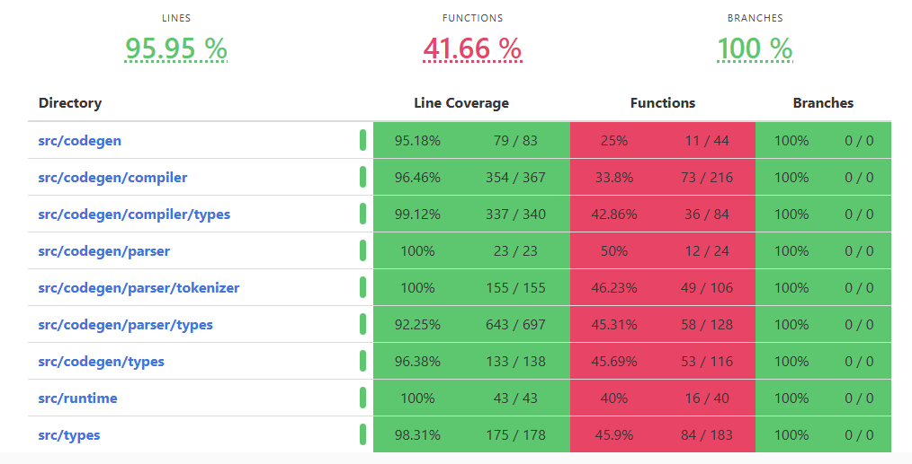

# Code coverage

- Install `llvm-tools`

```shell
rustup component add llvm-tools
```

- Install `grcov`

```
cargo install grcov
```

- cd to `$rust` directory and run test with instrument

```cmd
cmd> set RUSTFLAGS=-Cinstrument-coverage & set LLVM_PROFILE_FILE=..\\..\\..\\target\debug\sbolt\coverage\sblot-%p-%m.profraw & cargo test
```

```PS
PS> $Env:RUSTFLAGS="-Cinstrument-coverage"; $Env:LLVM_PROFILE_FILE="..\\..\\..\\target\debug\sbolt\coverage\sblot-%p-%m.profraw"; cargo test
```

```shell
shell> RUSTFLAGS="-C instrument-coverage" && LLVM_PROFILE_FILE="../../../target/debug/sbolt/coverage/sblot-%p-%m.profraw" && cargo test
```

- Generate code coverage report

```cmd
cmd> grcov ..\\target\\debug\\sbolt\\coverage -s .\\core\\lib --binary-path ..\\target\\debug -t html --branch --ignore-not-existing -o ..\\target\\debug\\sbolt\\coverage --ignore *tests\\* --ignore *test*.rs
```

```PS
PS> grcov ..\\target\\debug\\sbolt\\coverage -s .\\core\\lib --binary-path ..\\target\\debug -t html --branch --ignore-not-existing -o ..\\target\\debug\\sbolt\\coverage --ignore '*tests\\*' --ignore '*test*.rs'
```

```shell
shell> grcov ../target/debug/sbolt/coverage/ -s ./core/lib --binary-path ../target/debug/ -t html --branch --ignore-not-existing -o ../target/debug/sbolt/coverage/ --ignore '*tests/*' --ignore '*test*.rs'
```

- Report will be generated at: `../target/debug/sbolt/coverage/index.html`
>> 

**note:**  fuctions cc are not accurate with stable `rust`, follow [grcov](https://github.com/mozilla/grcov) instructions to use **nightly** `rust` to generate full report.