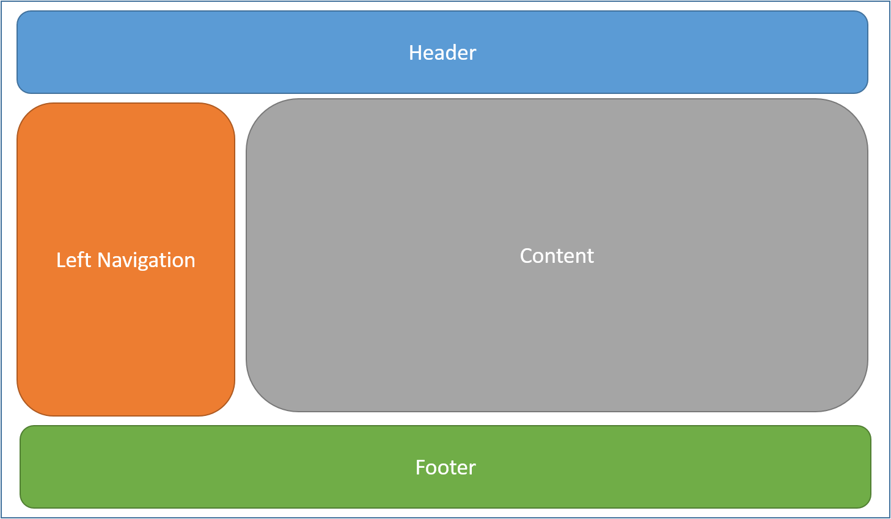

# Layout

Views usually share visual and programmatic elements.

- Use common layouts.
- Share UI elements.
- Share code logic before rendering template.

## What is a layout

Web apps usually have a common layout that provides a consistent experience as they navigate from page to page. The layout usually includes common UI elements such as the header, menu elements, and footer like:


HTML usually also contains resources like scripts and stylesheets, those are also used by many pages within an web app. All of these shared elements may be defined in a layout file, which can then be referenced by any template used within an web app. Layouts reduce duplicate logic in templates. 

## Use layout

- **use `@layout path`** to spefcify a layout template. 
```
@layout test
```

## sections
A layout can optionally reference one or more sections, by calling `@render`. Sections provide a way to organize where certain page elements should be placed. Each call to RenderSection can specify whether that section is required or optional:
- **define `section`** 

define a named section with name `s1`
```
@section s1 {
    this is section s1
}
```

define a anonymous section.
```
<div>
    anonymous section.
</div>
```

- **use `@render`** render anonymous section inside it's layout. 
```
<div>
    @render
</div>
```

- **use `@render(name, true|false)`** render a named section required or optional.

render as required
```
<div>
    @** render as required **@
    @render(s1)
</div>
```

render as required
```
<div>
    @** render as required **@
    @render(s1, true)
</div>
```

render as optional
```
<div>
    @** render as optional **@
    @render(s2, true)
</div>
```


---
###